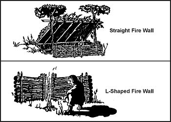
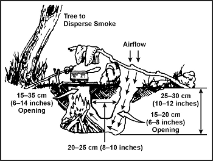
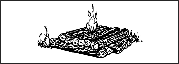
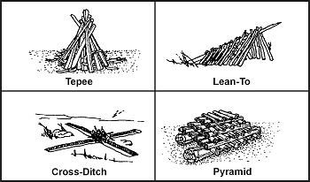
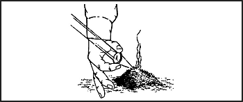
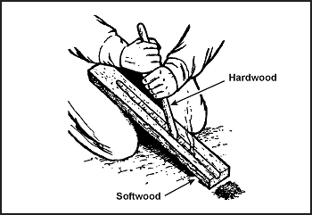
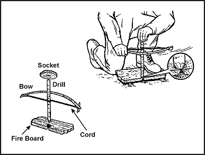

> In many survival situations, the ability to start a fire can make the difference between living and dying. Fire can fulfill many needs. It can provide warmth and comfort. It not only cooks and preserves food, it also provides warmth in the form of heated food that saves calories our body normally uses to produce body heat. You can use fire to purify water, sterilize bandages, signal for rescue, and provide protection from animals. It can be a psychological boost by providing peace of mind and companionship. You can also use fire to produce tools and weapons.
> 
> Fire can cause problems, as well. The enemy can detect the smoke and light it produces. It can cause forest fires or destroy essential equipment. Fire can also cause burns and carbon monoxide poisoning when used in shelters.
> 
> Weigh your need for fire against your need to avoid enemy detection.

### BASIC FIRE PRINCIPLES

To build a fire, it helps to understand the basic principles of a fire.
Fuel (in a nongaseous state) does not burn directly. When you apply heat to a fuel, it produces a gas. This gas, combined with oxygen in the air, burns.

Understanding the concept of the fire triangle is very important in correctly constructing and maintaining a fire.
The three sides of the triangle represent **air, heat,** and **fuel**.
If you remove any of these, the fire will go out.
The correct ratio of these components is very important for a fire to burn at its greatest capability.
The only way to learn this ratio is to practice.

### SITE SELECTION AND PREPARATION

You will have to decide what site and arrangement to use. Before building a fire consider:

* The area (terrain and climate) in which you are operating.
* The materials and tools available.
* Time; how much time do you have?
* Need; why do you need a fire?
* Security; do we have to hide it to prevent attracting problems?

Look for a dry spot that:

* Is protected from the wind.
* Is suitably placed in relation to your shelter (if any).
* Will concentrate the heat in the direction you desire.
* Has a supply of wood or other fuel available. ([Figure 7-4](#fig7-4) lists types of material you can use.)

If you are in a wooded or brush-covered area, clear the brush and scrape the surface soil from the spot you have selected. Clear a circle at least 1 meter (3 feet) in diameter so there is little chance of the fire spreading.

If time allows, construct a fire wall using logs or rocks. This wall will help to reflect or direct the heat where you want it ([Figure 7-1](#fig7-1)). It will also reduce flying sparks and cut down on the amount of wind blowing into the fire. However, you will need enough wind to keep the fire burning.

> **CAUTION**
> 
> Do not use wet or porous rocks as they may explode when heated.

**Figure 7-1\. Types of Fire Walls**

In some situations, you may find that an underground fireplace will best meet your needs.
It conceals the fire and serves well for cooking food.
To make an underground fireplace or Dakota fire hole ([Figure 7-2](#fig7-2)):

* Dig a hole in the ground.
* On the upwind side of this hole, poke or dig a large connecting hole for ventilation.
* Build your fire in the hole as illustrated.

**Figure 7-2\. Dakota Fire Hole**

If you are in a snow-covered area, use green logs to make a dry base for your fire ([Figure 7-3](#fig7-3)). Trees with wrist-sized trunks are easily broken in extreme cold. Cut or break several green logs and lay them side by side on top of the snow. Add one or two more layers. Lay the top layer of logs opposite those below it.

**Figure 7-3\. Base for Fire in Snow-covered Area**

### FIRE MATERIAL SELECTION

You need three types of materials ([Figure 7-4](#fig7-4)) to build a fire.

**Figure 7-4\. Materials for Building Fires**

**Figure 7-4\. Materials for Building Fires (Continued)**

Tinder is dry material that ignites with little heat—a spark starts a fire. The tinder must be absolutely dry to be sure just a spark will ignite it. If you have a device that generates only sparks, charred cloth will be almost essential. It holds a spark for long periods, allowing you to put tinder on the hot area to generate a small flame. You can make charred cloth by heating cotton cloth until it turns black, but does not burn. Once it is black, you must keep it in an airtight container to keep it dry. Prepare this cloth well in advance of any survival situation. Add it to your individual survival kit. Other impromptu items could be alcohol pads or petroleum jelly gauze.

Kindling is readily combustible material that you add to the burning tinder. Again, this material should be absolutely dry to ensure rapid burning. Kindling increases the fire's temperature so that it will ignite less combustible material.

Fuel is less combustible material that burns slowly and steadily once ignited.

### HOW TO BUILD A FIRE

There are several methods for laying a fire and each one has advantages.
The situation you are in will determine which of the following fires to use.

**TEPEE**

To make a tepee fire ([Figure 7-5](#fig7-5)), arrange the tinder and a few sticks of kindling in the shape of a tepee or cone. Light the center. As the tepee burns, the outside logs will fall inward, feeding the fire. T
his type of fire burns well even with wet wood.

**LEAN-TO**

To lay a lean-to fire ([Figure 7-5](#fig7-5)), push a green stick into the ground at a 30-degree angle.
Point the end of the stick in the direction of the wind. Place some tinder deep under this lean-to stick.
Lean pieces of kindling against the lean-to stick.
Light the tinder. As the kindling catches fire from the tinder, add more kindling.

**CROSS-DITCH**

To use the cross-ditch method ([Figure 7-5](#fig7-5)), scratch a cross about 30 centimeters (12 inches) in size in the ground. Dig the cross 7.5 centimeters (about 3 inches) deep. Put a large wad of tinder in the middle of the cross. Build a kindling pyramid above the tinder. The shallow ditch allows air to sweep under the tinder to provide a draft.

**PYRAMID**

To lay the pyramid fire ([Figure 7-5](#fig7-5)), place two small logs or branches parallel on the ground. Place a solid layer of small logs across the parallel logs. Add three or four more layers of logs, each layer smaller than and at a right angle to the layer below it. Make a starter fire on top of the pyramid. As the starter fire burns, it will ignite the logs below it. This gives you a fire that burns downward, requiring no attention during the night.

**Figure 7-5\. Methods for Laying Fires**

There are several other ways to lay a fire that are quite effective. Your situation and the material available in the area may make another method more suitable.

### HOW TO LIGHT A FIRE

Always light your fire from the upwind side.
Make sure you lay the tinder, kindling, and fuel so that your fire will burn as long as you need it.
Igniters provide the initial heat required to start the tinder burning.
They fall into two categories: modern methods and primitive methods.

**MODERN METHODS**

Modern igniters use modern devices. These are items that we normally think of to start a fire.

**Matches**

Make sure these matches are waterproof. Also, store them in a waterproof container along with a dependable striker pad.

**Convex Lens**

Use this method ([Figure 7-6](#fig7-6)) only on bright, sunny days.
The lens can come from binoculars, a camera, telescopic sights, or magnifying glasses.
Angle the lens to concentrate the sun's rays on the tinder.
Hold the lens over the same spot until the tinder begins to smolder.
Gently blow or fan the tinder into a flame and apply it to the fire lay.

**Figure 7-6\. Lens Method**

**Metal Match**

Place a flat, dry leaf under your tinder with a portion exposed. Place the tip of the metal match on the dry leaf, holding the metal match in one hand and a knife in the other. Scrape your knife against the metal match to produce sparks. The sparks will hit the tinder. When the tinder starts to smolder, proceed as above.

**Battery**

Use a battery to generate a spark. Use of this method depends on the type of battery available.
Attach a wire to each terminal.
Touch the ends of the bare wires together next to the tinder so the sparks will ignite it.
If you need to charge the battery first - have a look into the [Power Section](Power)

**Gunpowder**

Often, you will have ammunition with your equipment. If so, carefully extract the bullet from the shell casing by moving the bullet back and forth. Use the gunpowder as tinder. Discard the casing and primers. A spark will ignite the powder.

**NOTE:** Be extremely careful during this operation as the primers are still sensitive and even a small pile of gunpowder can give surprising results.

**PRIMITIVE METHODS**

Primitive igniters are those attributed to our early ancestors.
They can be time-consuming, which requires you to be patient and persistent.

**Flint and Steel**

The direct spark method is the easiest of the primitive methods to use.
The flint and steel method is the most reliable of the direct spark methods.
Strike a flint or other hard, sharp-edged rock with a piece of carbon steel (stainless steel will not produce a good spark). This method requires a loose-jointed wrist and practice.
When the tinder catches a spark, blow on it.
The spark will spread and burst into flames.

**Fire-Plow**

The fire-plow ([Figure 7-7](#fig7-7)) is a friction method of ignition. To use this method, cut a straight groove in a softwood base and plow the blunt tip of a hardwood shaft up and down the groove. The plowing action of the shaft pushes out small particles of wood fibers. Then, as you apply more pressure on each stroke, the friction ignites the wood particles.

**Figure 7-7\. Fire-Plow**

**Bow and Drill**

The technique of starting a fire with a bow and drill ([Figure 7-8](#fig7-8)) is simple, but you must exert much effort and be persistent to produce a fire.
 You need the following items to use this method:

* _Socket._ The socket is an easily grasped stone or piece of hardwood with a slight depression in one side. Use it to hold the drill in place and to apply downward pressure.
* _Drill._ The drill should be a straight, seasoned hardwood stick about 2 centimeters (3/4 inch) in diameter and 25 centimeters (10 inches) long. The top end is round and the low end blunt (to produce more friction).
* _Fire board._ Although any board may be used, a seasoned softwood board about 2.5 centimeters (1 inch) thick and 10 centimeters (4 inches) wide is preferable. Cut a depression about 2 centimeters (3/4 inch) from the edge on one side of the board. On the underside, make a V-shaped cut from the edge of the board to the depression.
* _Bow._ The bow is a resilient, green stick about 2.5 centimeters (3/4 inch) in diameter with a bowstring. The type of wood is not important. The bowstring can be any type of cordage. Tie the bowstring from one end of the bow to the other, without any slack.

**Figure 7-8\. Bow and Drill**

To use the bow and drill, first prepare the fire lay.
Then place a bundle of tinder under the V-shaped cut in the fire board.
Place one foot on the fire board.
Loop the bowstring over the drill and place the drill in the precut depression on the fire board.
Place the socket, held in one hand, on the top of the drill to hold it in position.
Press down on the drill and saw the bow back and forth to twirl the drill ([Figure 7-8](#fig7-8)).
Once you have established a smooth motion, apply more downward pressure and work the bow faster.
This action will grind hot black powder into the tinder, causing a spark to catch.
Blow on the tinder until it ignites.

Primitive fire-building methods are exhausting and require practice to ensure success. If your survival situation requires the use of primitive methods, remember the following hints to help you construct and maintain the fire:

* If possible, use nonaromatic seasoned hardwood for fuel.
* Collect kindling and tinder along the trail.
* Add insect repellent to the tinder.
* Keep the firewood dry.
* Dry damp firewood near the fire.
* Bank the fire to keep the coals alive overnight.
* Carry lighted punk, when possible.
* Be sure the fire is out before leaving camp.
* Do not select wood lying on the ground. It may appear to be dry but generally doesn't provide enough friction.
