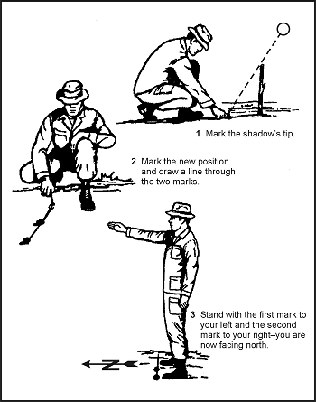
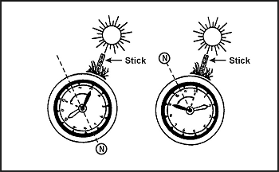
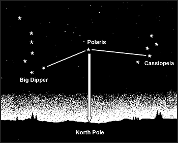
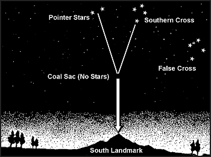

> In a survival situation, you will be extremely fortunate if you happen to have a map and compass. If you do have these two pieces of equipment, you will most likely be able to move toward help. If you are not proficient in using a map and compass, you must take the steps to gain this skill.
> 
> There are several methods by which you can determine direction by using the sun and the stars. These methods, however, will give you only a general direction. You can come up with a more nearly true direction if you know the terrain of the territory or country.
> 
> You must learn all you can about the terrain of the country or territory to which you or your unit may be sent, especially any prominent features or landmarks. This knowledge of the terrain together with using the methods explained below will let you come up with fairly true directions to help you navigate.

### USING THE SUN AND SHADOWS

18-1\. The earth's relationship to the sun can help you to determine direction on earth. The sun always rises in the east and sets in the west, but not exactly due east or due west. There is also some seasonal variation. Shadows will move in the opposite direction of the sun. In the Northern Hemisphere, they will move from west to east, and will point north at noon. In the Southern Hemisphere, shadows will indicate south at noon. With practice, you can use shadows to determine both direction and time of day. The shadow methods used for direction finding are the shadow-tip and watch methods.

**SHADOW-TIP METHODS**

18-2\. In the first shadow-tip method, find a straight stick 1 meter (3 feet) long, and a level spot free of brush on which the stick will cast a definite shadow. This method is simple and accurate and consists of four steps:
*  _Step 1._ Place the stick or branch into the ground at a level spot where it will cast a distinctive shadow. Mark the shadow's tip with a stone, twig, or other means. This first shadow mark is always west—**everywhere** on earth.
*  _Step 2._ Wait 10 to 15 minutes until the shadow tip moves a few centimeters. Mark the shadow tip's new position in the same way as the first. This mark will represent East.
*  _Step 3._ Draw a straight line through the two marks to obtain an approximate east-west line.
*  _Step 4._ Stand with the first mark (west) to your left and the second mark to your right—you are now facing north. This fact is true **everywhere** on earth.

18-3\. An alternate method is more accurate but requires more time. Set up your shadow stick and mark the first shadow in the morning. Use a piece of string to draw a clean arc through this mark and around the stick. At midday, the shadow will shrink and disappear. In the afternoon, it will lengthen again and at the point where it touches the arc, make a second mark. Draw a line through the two marks to get an accurate east-west line ([Figure 18-1](#fig18-1)).

**Figure 18-1\. Shadow-Tip Method**

**THE WATCH METHOD**

18-4\. You can also determine direction using a common or analog watch—one that has hands. The direction will be accurate if you are using true local time, without any changes for daylight savings time. Remember, the further you are from the equator, the more accurate this method will be. If you only have a digital watch, draw a clock face on a circle of paper with the correct time on it and use it to determine your direction at that time. You may also choose to draw a clock face on the ground or lay your watch on the ground for a more accurate reading.

18-5\. In the Northern Hemisphere, hold the watch horizontal and point the hour hand at the sun. Bisect the angle between the hour hand and the 12-o'clock mark to get the north-south line ([Figure 18-2](#fig18-2)). If there is any doubt as to which end of the line is north, remember that the sun rises in the east, sets in the west, and is due south at noon. The sun is in the east before noon and in the west after noon.

**Figure 18-2\. Watch Method**

**NOTE:** If your watch is set on daylight savings time, use the midway point between the hour hand and 1 o'clock to determine the north-south line.

18-6\. In the Southern Hemisphere, point the watch's 12-o'clock mark toward the sun; a midpoint halfway between 12 and the hour hand will give you the north-south line ([Figure 18-2](#fig18-2)).

18-7\. Another method is called the 24-hour clock method. Take the local military time and divide it by two. Imagine this result to now represent the hour hand. In the Northern Hemisphere, point this resulting hour hand at the sun, and the 12 will point north. For example, it is 1400 hours. Divide 1400 by two and the answer is 700, which will represent the hour. Holding the watch horizontal, point the 7 at the sun and 12 will point north. In the Southern Hemisphere, point the 12 at the sun, and the resulting "hour" from the division will point south.

### USING THE MOON

18-8\. Because the moon has no light of its own, we can only see it when it reflects the sun's light. As it orbits the earth on its 28-day circuit, the shape of the reflected light varies according to its position. We say there is a new moon or no moon when it is roughly on the same side of the earth as the sun, so its illuminated side cannot be seen while pointing away from the earth. Then, as it moves on orbiting the earth, it begins to show illuminated parts from its right side and waxes to become a full moon before waning, or losing shape, to appear as a sliver on the left side. You can use this information to identify direction.

18-9\. If the moon rises before the sun has set, the illuminated side will be the west. If the moon rises after midnight, the illuminated side will be the east. This obvious discovery provides us with a rough east-west reference during the night.

### USING THE STARS

18-10\. Your location in the Northern or Southern Hemisphere determines which constellation you use to determine your north or south direction. Each sky is explained below.

**THE NORTHERN SKY**

18-11\. The main constellations to learn are the Ursa Major, also known as the Big Dipper or the Plow, and Cassiopeia, also known as the Lazy W ([Figure 18-3](#fig18-3)). Use them to locate Polaris, also known as the polestar or the North Star. Polaris is considered to remain stationary, as it rotates only 1.08 degrees around the northern celestial pole. The North Star is the last star of the Little Dipper's handle and can be confused with the Big Dipper. However, the Little Dipper is made up of seven rather dim stars and is not easily seen unless you are far away from any town or city lights. Prevent confusion by attempting to use both the Big Dipper and Cassiopeia together. The Big Dipper and Cassiopeia are generally opposite each other and rotate counterclockwise around Polaris, with Polaris in the center. The Big Dipper is a seven-star constellation in the shape of a dipper. The two stars forming the outer lip of this dipper are the "pointer stars" because they point to the North Star. Mentally draw a line from the outer bottom star to the outer top star of the Big Dipper's bucket. Extend this line about five times the distance between the pointer stars. You will find the North Star along this line. You may also note that the North Star can always be found at the same approximate vertical angle above the horizon as the northern line of latitude you are located on. For example, if you are at 35 degrees north latitude, Polaris will be easier to find if you scan the sky at 35 degrees off the horizon. This will help to lessen the area of the sky in which to locate the Big Dipper, Cassiopeia, and the North Star.

**Figure 18-3\. The Big Dipper and Cassiopeia**

18-12\. Cassiopeia or the Lazy W has five stars that form a shape like a "W." One side of the "W" appears flattened or "lazy." The North Star can be found by bisecting the angle formed on the lazy side. Extend this line about five times the distance between the bottom of the "W" and the top. The North Star is located between Cassiopeia and the Ursa Major (Big Dipper).

18-13\. After locating the North Star, locate the North Pole or true north by drawing an imaginary line directly to the earth.

**THE SOUTHERN SKY**

18-14\. Because there is no single star bright enough to be easily recognized near the south celestial pole, you can use a constellation known as the Southern Cross. You can use it as a signpost to the South ([Figure 18-4](#fig18-4)). The Southern Cross or Crux has five stars. Its four brightest stars form a cross. The two stars that make up the Cross's long axis are used as a guideline. To determine south, imagine a distance four-and-one-half to five times the distance between these stars and the horizon. The pointer stars to the left of the Southern Cross serve two purposes. First, they provide an additional cue toward south by imagining a line from the stars toward the ground. Second, the pointer stars help accurately identify the true Southern Cross from the False Cross. The intersection of the Southern Cross and the two pointer stars is very dark and devoid of stars. This area is called the coal sac. Look down to the horizon from this imaginary point and select a landmark to steer by. In a static survival situation, you can fix this location in daylight if you drive stakes in the ground at night to point the way.

**Figure 18-4\. Southern Cross**

**The Orion Method**

18-14b\. In the tropics, identification of the celestial poles may be impossible because of the low latitude. The constellation of Orion rises due east and sets due west. A line joining the two northern stars of Orion runs east-west. ([Figure 18-4b](#fig18-4b)).

**Figure 18-4b\. Orion Method**

### MAKING IMPROVISED COMPASSES

18-15\. You can construct improvised compasses using a piece of ferrous metal that can be needleshaped or a flat double-edged razor blade and a piece of thread or long hair from which to suspend it. You can magnetize or polarize the metal by slowly stroking it in one direction on a piece of silk or carefully through your hair using deliberate strokes. You can also polarize metal by stroking it repeatedly at one end with a magnet. Always stroke in one direction only. If you have a battery and some electric wire, you can polarize the metal electrically. The wire should be insulated. If it is not insulated, wrap the metal object in a single, thin strip of paper or a leaf to prevent contact. The battery must be a minimum of 2 volts. Form a coil with the electric wire and touch its ends to the battery's terminals. Repeatedly insert one end of the metal object in and out of the coil. The needle will become an electromagnet. When suspended from a piece of nonmetallic string, or floated on a small piece of wood, cork or a leaf in water, it will align itself with a north-south line.

18-16\. You can construct a more elaborate improvised compass using a sewing needle or thin metallic object, a nonmetallic container (for example, the cut-off bottom of a plastic container or soft drink bottle), and the silver tip from a pen. To construct this compass, take an ordinary sewing needle and break in half. One half will form your direction pointer and the other will act as the pivot point. Push the portion used as the pivot point through the bottom center of your container; this portion should be flush on the bottom and not interfere with the lid. Attach the center of the other portion (the pointer) of the needle on the pen's silver tip using glue, tree sap, or melted plastic. Magnetize one end of the pointer and rest it on the pivot point.

### OTHER MEANS OF DETERMINING DIRECTION

18-17\. The old saying about using moss on a tree to indicate north is not considered accurate because moss grows completely around some trees. Actually, growth is more lush on the side of the tree facing the south in the Northern Hemisphere and vice versa in the southern hemisphere. If there are several felled trees around for comparison, look at the stumps. Growth is more vigorous on the side toward the equator and the tree growth rings will be more widely spaced. On the other hand, the tree growth rings will be closer together on the side toward the poles.

18-18\. Wind direction may be helpful in some instances where there are prevailing directions and you know what they are.

18-19\. Recognizing the differences between vegetation and moisture patterns on north- and south-facing slopes can aid in determining direction. In the Northern Hemisphere, north-facing slopes receive less sun than south-facing slopes and are therefore cooler and damper. In the summer, north-facing slopes retain patches of snow. In the winter, trees and open areas on south-facing slopes and the southern side of boulders and large rocks are the first to lose their snow. The ground snowpack is also shallower due to the warming effects of the sun. In the Southern Hemisphere, all of these effects will be the opposite.
