> Fish and mollusks may be one of your major sources of food. Therefore, it is wise to know which ones are dangerous, what the dangers of the various fish are, what precautions to take, and what to do if you are injured by one of these fish.
> 
> Fish and mollusks will present a danger in one of three ways—by attacking and biting you, by injecting toxic venom into you through venomous spines or tentacles, and through eating fish or mollusks whose flesh is toxic.
> 
> The danger of actually encountering one of these dangerous fish is relatively small, but it is still significant. Any one of these fish can kill you. Avoid them if at all possible.

### FISH THAT ATTACK MAN

The shark is usually the first fish that comes to mind when considering fish that attack man. Other fish also fall in this category, such as the barracuda, the moray eel, and the piranha.

**SHARKS**

Sharks are potentially the most dangerous fish that attack people. The obvious danger of sharks is that they are capable of seriously maiming or killing you with their bite. Of the many shark species, only a relative few are dangerous. Most cases of shark attacks on humans are by the white, tiger, hammerhead, and blue sharks. There are also records of attacks by ground, gray nurse, and mako sharks. [Figure F-1](#figf-1), shows various sharks and their sizes.

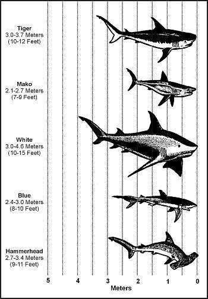

**Figure F-1\. Sharks**

Avoid sharks if at all possible. Follow the procedures discussed in [Chapter 16](16) to defend yourself against a shark attack.

Sharks vary in size, but there is no relationship between the size of the shark and likelihood of attack. Even the smaller sharks can be dangerous, especially when they are traveling in schools.

If bitten by a shark, the most important measure for you to take is to stop the bleeding quickly. Blood in the water will attract more sharks. Get yourself or the victim into a raft or to shore as soon as possible. If in the water, form a circle around the victim (if not alone), and stop the bleeding with a tourniquet.

**OTHER FEROCIOUS FISH**

In saltwater, other ferocious fish include the barracuda, sea bass, and moray eel ([Figure F-2](#figf-2)). The sea bass is usually an open water fish. It is dangerous due to its large size. It can remove large pieces of flesh from a human. Barracudas and moray eels have been known to attack man and inflict vicious bites. Be careful of these two species when near reefs and in shallow water. Moray eels are very aggressive when disturbed.

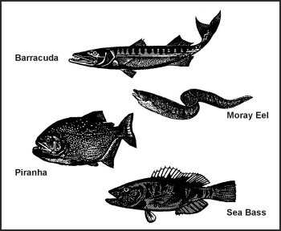

**Figure F-2\. Ferocious Fish**

In fresh water, piranha are the only significantly dangerous fish. They are inhabitants of the tropics and are restricted to northern South America. These fish are fairly small, about 25 to 60 centimeters (10 to 24 inches), but they have very large teeth and travel in large schools. They can devour a full-grown hog in minutes.

### VENOMOUS FISH AND INVERTEBRATES

There are several species of venomous fish and invertebrates, all of which live in saltwater. All of these are capable of injecting poisonous venom through spines located in their fins, tentacles, or bites. Their venoms cause intense pain and are potentially fatal. If injured by one of the following fish or invertebrates, treat the injury as for snakebite.

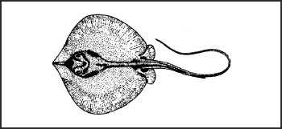

**Stingray**  
_Dasyatidae_ species  

Stingrays inhabit shallow water, especially in the tropics, but in temperate regions as well. All have a distinctive ray shape, but coloration may make them hard to spot unless they are swimming. The venomous, barbed spines in their tails can cause severe or fatal injury.
** *

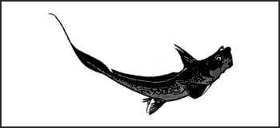

**Rabbitfish**  
_Siganidae_ species  

Rabbitfish are found predominantly on the reefs in the Pacific and Indian oceans. They average about 30 centimeters (12 inches) long and have very sharp spines in their fins. The spines are venomous and can inflict intense pain.
** *

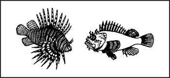

**Scorpion fish or zebra fish**  
_Scorpaenidae_ species  

Scorpion fish live mainly in the reefs in the Pacific and Indian oceans. They vary from 30 to 90 centimeters (12 to 35 inches) long, are usually reddish in coloration, and have long wavy fins and spines. They inflict an intensely painful sting.
** *

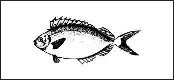

**Siganus fish**  

The siganus fish is small, about 10 to 15 centimeters (4 to 6 inches) long, and looks much like a small tuna. It has venemous spines in its dorsal and ventral fins. These spines can inflict painful stings.
** *

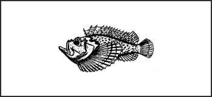

**Stonefish**  
_Synanceja_ species  

Stonefish are found in the tropical waters of the Pacific and Indian oceans. Averaging about 30 centimeters (12 inches) in length, their subdued colors and lumpy shape provide them with exceptional camouflage. When stepped on, the fins in the dorsal spine inflict an extremely painful and sometimes fatal wound.
** *

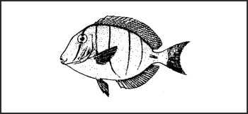

**Tang or surgeonfish**  
_Acanthuridae_ species  

Tang or surgeonfish average 20 to 25 centimeters (8 to 10 inches) in length, with a deep body, small mouth, and bright coloration. They have needlelike spines on the side of the tail that cause extremely painful wounds. This fish is found in all tropical waters.
** *

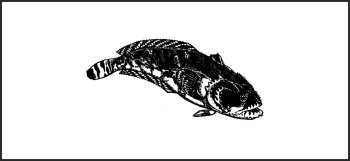

**Toadfish**  
_Batrachoididae_ species  

Toadfish are found in the tropical waters off the coasts of South and Central America. They are between 17.5 and 25 centimeters (7 to 10 inches) long and have a dull color and large mouths. They bury themselves in the sand and may be easily stepped on. They have very sharp, extremely poisonous spines on the dorsal fin (back).
** *

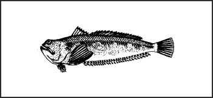

**Weever fish**  
_Trachinidae_ species  

The weever fish is a tropical fish that is fairly slim and about 30 centimeters (12 inches) long. All its fins have venomous spines that cause a painful wound.
** *

**Blue-ringed octopus**  
_Hapalochlaena_ species  

This small octopus is usually found on the Great Barrier Reef off eastern Australia. It is grayish-white with iridescent blue ringlike markings. This octopus usually will not bite unless stepped on or handled. Its bite is extremely poisonous and frequently lethal.
** *

**Portuguese man-of-war**  
_Physalis_ species  

Although it resembles a jellyfish, the Portuguese man-of-war is actually a colony of sea animals. Mainly found in tropical regions; however, the Gulf stream current can carry it as far as Europe. It is also found as far south as Australia. The floating portion of the man-of-war may be as small as 15 centimeters (6 inches), but the tentacles can reach 12 meters (40 feet) in length. These tentacles inflict a painful and incapacitating sting, but it is rarely fatal.
** *

**Cone shells**  
_Conidae_ species  

These cone-shaped shells have smooth, colorful mottling and long, narrow openings in the base of the shell. They live under rocks, in crevices and coral reefs, and along rocky shores and protected bays in tropical areas. All have tiny teeth that are similar to hypodermic needles. They can inject an extremely poisonous venom that acts very swiftly, causing acute pain, swelling, paralysis, blindness, and possible death within hours. Avoid handling all cone shells.
** *

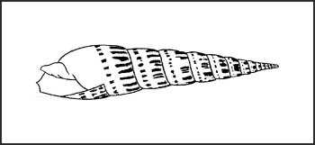

**Terebra shells**  
_Terebridae_ species  

These shells are found in both temperate and tropical waters. They are similar to cone shells but much thinner and longer. They poison in the same way as cone shells, but their venom is not as poisonous.
### FISH WITH TOXIC FLESH

There are no simple rules to tell edible fish from those with poisonous flesh. [Figure 8-2](08#fig8-2) shows the most common toxic fish. All of these fish contain various types of poisonous substances or toxins in their flesh and are dangerous to eat. They have the following common characteristics:
*  Most live in shallow water around reefs or lagoons.
*  Many have boxy or round bodies with hard shell-like skins covered with bony plates or spines. They have small parrotlike mouths, small gills, and small or absent belly fins. Their names suggest their shape.

In addition to the above fish and their characteristics, barracuda and red snapper fish may carry ciguatera, a toxin that accumulates in the systems of fish that feed on tropical marine reefs.

Without specific local information, take the following precautions:
*  Be very careful with fish taken from normally shallow lagoons with sandy or broken coral bottoms. Reef-feeding species predominate and some may be poisonous.
*  Avoid poisonous fish on the leeward side of an island. This area of shallow water consists of patches of living corals mixed with open spaces and may extend seaward for some distance. Many different types of fish, some poisonous, inhabit these shallow waters.
*  Do not eat fish caught in any area where the water is unnaturally discolored. The discoloration may be indicative of plankton that cause various types of toxicity in plankton-feeding fish.
*  Try fishing on the windward side or in deep passages leading from the open sea to the lagoon, but be careful of currents and waves. Live coral reefs drop off sharply into deep water and form a dividing line between the _suspected fish of the shallows_ and the _desirable deep-water species_. Deepwater fish are usually not poisonous. You can catch the various toxic fish even in deep water. _Discard all suspected reef fish,_ whether caught on the ocean or the reef side.
