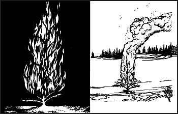
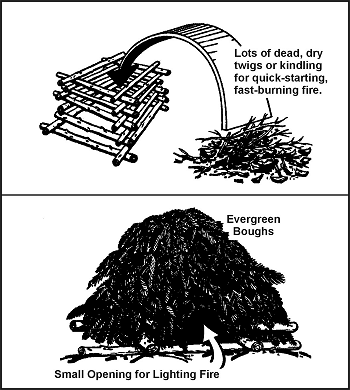
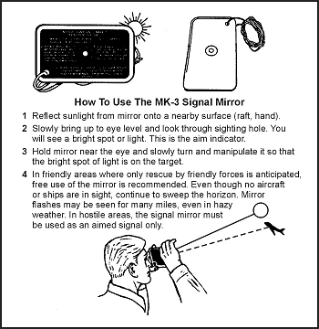
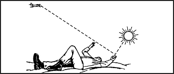
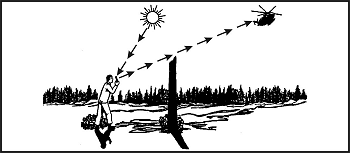
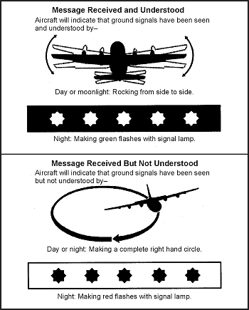

> One of your first concerns when you find yourself in a survival situation is to communicate with your friends or allies. Generally, communication is the giving and receiving of information. In a survival situation, you must first get your rescuer's attention, then second, send a message your rescuer understands. Some attention-getters are man-made geometric patterns such as straight lines, circles, triangles, or Xs displayed in uninhabited areas; a large fire or flash of light; a large, bright object moving slowly; or contrast, whether from color or shadows. The type of signal used will depend on your environment and the enemy situation.

### APPLICATION

19-1\. If in a noncombat situation, you need to find the largest available clear and flat area _on the highest possible terrain._ Use as obvious a signal as you can create. On the other hand, you will have to be more discreet in combat situations. You do not want to signal and attract the enemy. Pick an area that is visible from the air, but ensure there are hiding places nearby. Try to have a hill or other object between the signal site and the enemy to mask your signal from the enemy. Perform a thorough reconnaissance of the area to ensure there are no enemy forces nearby.

19-2\. Whatever signaling technique or device you plan to use, know how to use it and be ready to put it into operation on short notice. If possible, avoid using signals or signaling techniques that can physically endanger you. Keep in mind that signals to your _friends_ may alert the enemy of your presence and location. Before signaling, carefully weigh your rescue chances by _friends_ against the danger of capture by the enemy.

19-3\. A radio is probably the surest and quickest way to let others know where you are and to let you receive their messages. Become familiar with the radios in your unit. Learn how to operate them and how to send and receive messages.

19-4\. You will find descriptions of other signaling techniques, devices, and articles you can use. Learn how to use them. Think of ways in which you can adapt or change them for different environments. Practice using these signaling techniques, devices, and articles before you need them. Planned, prearranged signaling techniques may improve your chance of rescue.

### MEANS FOR SIGNALING

19-5\. There are two main ways to get attention or to communicate—visual and audio. The means you use will depend on your situation and the material you have available. Whatever the means, always have visual and audio signals ready for use. Throughout this chapter you will see references to "groups of threes." This is because nature does not normally replicate anything in groups of three. "Things in threes" tend more often to be manmade sounds or visual signals.

**VISUAL SIGNALS**

19-6\. These signals are materials or equipment you use to make your presence known to rescuers. Visual signals can include fire, smoke, flares, and many other means of signaling.

**Fire**

19-7\. During darkness, fire is an effective visual means for signaling. Build three fires in a triangle (the international distress signal) or in a straight line with about 25 meters (83 feet) between the fires. Build them as soon as time and the situation permit and protect them from the elements until you need them. If you are alone, maintaining three fires may be difficult. If so, maintain one signal fire. The hot coal bed left by a fire also may be seen by aerial platforms that are equipped to detect infrared or thermal signatures.

19-8\. When constructing signal fires, consider your geographic location. If in a jungle, find a natural clearing or the edge of a stream where you can build fires that the jungle foliage will not hide. You may even have to clear an area. If in a snow-covered area, you may have to clear the ground of snow or make a platform on which to build the fire so that melting snow will not extinguish it.

19-9\. A burning tree (tree torch) is another way to attract attention ([Figure 19-1](#fig19-1)). You can set pitch-bearing trees afire, even when green. You can get other types of trees to burn by placing dry wood in the lower branches and igniting it so that the flames flare up and ignite the foliage. Before the primary tree is consumed, cut and add more small green trees to the fire to produce more smoke. Always select an isolated tree so that you do not start a forest fire and endanger yourself.

**Figure 19-1\. Tree Torch**

**Smoke**

19-10\. During daylight, build a smoke generator and use smoke to gain attention ([Figure 19-2](#fig19-2)). The international distress signal is three columns of smoke. Try to create a color of smoke that contrasts with the background; dark smoke against a light background and vice versa. If you practically smother a large fire with green leaves, moss, or a little water, the fire will produce white smoke. If you add rubber or oil-soaked rags to a fire, you will get black smoke.

**Figure 19-2\. Smoke Generator—Ground**

19-11\. In a desert environment, smoke hangs close to the ground, but a pilot can spot it in open desert terrain.

19-12\. Smoke signals are effective only on comparatively calm, clear days. High winds, rain, or snow disperse smoke, lessening its chances of being seen.

**Smoke Grenades**

19-13\. If you have smoke grenades with you, use them in the same pattern as described for fires. Keep them dry so that they will work when you need them. Take care not to ignite the vegetation in the area when you use them. Red is an internationally recognized color of distress, but any color smoke, if properly used, will attract attention.

**Pen Flares**

19-14\. The M185 signal device is part of an aviator's survival vest. The device consists of a pen-shaped gun with a flare attached by a nylon cord. When fired, the pen flare sounds like a pistol shot and fires the flare about 150 meters (495 feet) high. It is about 3 centimeters (1 inch) in diameter.

19-15\. To have the pen flare ready for immediate use, take it out of its wrapper, partially screw on the flare, leave the gun uncocked, and drape the cord around your neck. Be ready to fire it well in front of search aircraft in a nonthreatening direction and be ready with a secondary signal. Also, be ready to take cover in case the pilot mistakes the flare for enemy fire. It is important to note that pen flares may deflect off tree limbs and tree canopies. This may cause the flare to deflect or shoot back to the ground, causing a forest fire hazard. Ensure you have proper overhead clearance and an obstacle-free path to shoot through.

**Gyro-Jets**

19-16\. These devices are the newer version of the pen flare. They differ in that they are jet-powered rather than ballistic like the pen flares. They will reach a height of up to 300 meters (990 feet). To prepare them for firing, the flares are pushed until firmly seated into a crimped collar rather than a threaded screw-on type assembly. They are designed to better penetrate tree canopies, but do not rely on this to always happen. Always ensure you have a clear path in which to aim and fire all overhead pyrotechnics. Again, groups of threes are internationally recognized symbols of distress.

**Tracer Ammunition**

19-17\. You may use rifle or pistol tracer ammunition to signal search aircraft. **Do not** fire the ammunition in front of the aircraft. As with pen flares, be ready to take cover if the pilot mistakes your tracers for enemy fire. Again, groups of threes are internationally recognized symbols of distress.

**Star Clusters**

19-18\. Red is the international distress color; therefore, use a red star cluster whenever possible. However, any color will let your rescuers know where you are. Star clusters reach a height of 200 to 215 meters (660 to 710 feet), burn an average of 6 to 10 seconds, and descend at a rate of 14 meters (46 feet) per second.

**Star Parachute Flares**

19-19\. These flares reach a height of 200 to 215 meters (660 to 710 feet) and descend at a rate of 2.1 meters (7 feet) per second. The M126 (red) burns about 50 seconds and the M127 (white) about 25 seconds. At night you can see these flares at 48 to 56 kilometers (30 to 34 miles).

**MK-13 and MK-124**

19-20\. These signals are normally found on aircraft and lift rafts. They produce an orange smoke on one end for day signaling and a flare on the other end for nighttime use. The smoke lasts for approximately 15 seconds and the flare lasts 20 to 25 seconds. Though the signal is designed for use on a life raft, they do not float. They are designed to be handheld, but hold the device by the far end that is not being used to prevent burns. Note that after expending either signal the other end is still available for use, so do not discard it until both ends have been used. There are numerous redundant markings on each side of the flare to ensure that you activate the correct signal, day or night. The end caps are colored, raised protrusions or nipples are present, and a washer is on the pull ring to differentiate night and day.

**Mirrors or Shiny Objects**

19-21\. On a sunny day, a mirror is your best signaling device. If you don't have a mirror, polish your canteen cup, your belt buckle, or a similar object that will reflect the sun's rays. Direct the flashes in one area so that they are secure from enemy observation. Practice using a mirror or shiny object for signaling **now**; do not wait until you need it. If you have an MK-3 signal mirror, follow the instructions on its back ([Figure 19-3](#fig19-3)). An alternate, easier method of aiming the signal mirror is to catch the reflection on the palm of your hand or in between two fingers held up in a "V" or "peace sign." Now slowly move your hand so that it is just below your aim point or until the aircraft is between the "V" in your fingers, keeping the glare on your palm. Then move the mirror slowly and rhythmically up and down off your hand and onto the aim point as in [Figures 19-4](#fig19-4) and [19-5](#fig19-5).

**Figure 19-3\. MK-3 Signal Mirror**

**Figure 19-4\. Aiming an Improvised Signal Mirror**

**Figure 19-5\. Aiming an Improvised Signal Mirror Using a Stationary Object**

19-22\. Wear the signal mirror on a cord or chain around your neck so that it is ready for immediate use. However, be sure the glass side is against your body so that it will not flash; the enemy can see the flash.

19-23\. Haze, ground fog, and mirages may make it hard for a pilot to spot signals from a flashing object. So, if possible, get to the highest point in your area when signaling. If you can't determine the aircraft's location, flash your signal in the direction of the aircraft noise.

**NOTE:** Pilots have reported seeing mirror flashes up to 160 kilometers (96 miles) away under ideal conditions.

**Flashlight or Strobe Light**

19-24\. At night you can use a flashlight or a strobe light to send an SOS to an aircraft. When using a strobe light, take care to prevent the pilot from mistaking it for incoming ground fire. The strobe light flashes 60 times per minute. Some strobe lights have infrared covers and lenses. Blue flash collimators are also available for strobe lights that aid in distinguishing the flashing of the strobe light from a muzzle flash, and also make the strobe light directional.

**Laser Devices**

19-25\. Laser aiming devices on weapons systems are highly visible. So are targeting pointers and many commercial types of laser presentation pointers.

**Firefly Lights**

19-26\. These small lights, about 3 centimeters (1 1/4 inches) square and 1 centimeter (1/8 inch) thick, snap onto 9-volt batteries. They are available in a variety of visible and infrared, blinking and steady light versions. The visible range and battery duration will depend on the intensity of the bulb and the mode each light uses. Other models incorporate a 4-second programmable memory that allows users to input any particular code they wish.

**VS-17 Panel**

19-27\. During daylight you can use a VS-17 panel to signal. Place the orange side up as it is easier to see from the air than the violet side. Flashing the panel will make it easier for the aircrew to spot. You can use any bright orange or violet cloth as a substitute for the VS-17.

**Clothing**

19-28\. Spreading clothing on the ground or in the top of a tree is another way to signal. Select articles whose color will contrast with the natural surroundings. Arrange them in a large geometric pattern to make them more likely to attract attention.

**Natural Material**

19-29\. If you lack other means, you can use natural materials to form a symbol or message that can be seen from the air. Build mounds that cast shadows; you can use brush, foliage of any type, rocks, or snow blocks.

19-30\. In snow-covered areas, tramp the snow to form letters or symbols and fill the depression with contrasting material (twigs or branches). In sand, use boulders, vegetation, or seaweed to form a symbol or message. In brush-covered areas, cut out patterns in the vegetation or sear the ground. In tundra, dig trenches or turn the sod upside down.

19-31\. In any terrain, use contrasting materials that will make the symbols visible to the aircrews. Orient the signal in a north-south fashion to attain the maximum benefit of the sun's shadow for contrast and recognition.

**Sea Dye Markers**

19-32\. All aircraft involved in operations near or over water will normally carry a water survival kit that contains sea dye markers. If you are in a water survival situation, use sea dye markers during daylight to indicate your location. These spots of dye stay conspicuous for about 3 hours, except in very rough seas. Use them only if you are in a friendly area. Keep the markers wrapped until you are ready to use them. The sea dye is visible at a distance of more than 11 kilometers (7 miles) from an aircraft at 2,000 feet, so you should use them only when you hear or sight an aircraft. To further conserve them do not use them all at once. Dip the marker bag in the water until a slick about 30 meters (100 feet) appears. Sea dye markers are also very effective on snow-covered ground; use them to write distress code letters.

**NOTE:** Rumors have persisted about how sea dye attracts sharks. The U.S. Navy has conducted research, and no scientific data has been found to support this rumor. Sharks are naturally curious and are drawn to strange objects in their area. Therefore, a shark may investigate a person, with or without sea dye, as a possible food source. Do not be afraid to use sea dye markers; it may be your last or only chance to signal a rescue aircraft.

**AUDIO SIGNALS**

19-33\. Your other means of signaling a rescuer can be audio signals. Radios, whistles, and gunshots are some of the methods you can use to signal your location.

**Radio Equipment**

19-34\. The AN/PRC-90 survival radio is a part of the Army aviator's survival vest. The AN/PRC-112 will eventually replace the AN/PRC-90\. Both radios can transmit either tone or voice. Any other type of Army radio can do the same. The ranges of the different radios vary depending on the altitude of the receiving aircraft, terrain, vegetation density, weather, battery strength, type of radio, and interference. To obtain maximum performance from radios, use the following procedures:

*  Try to transmit only in clear, unobstructed terrain. Since radios are line-of-sight communications devices, any terrain between the radio and the receiver will block the signal.
*  Keep the antenna at right angles to the rescuing aircraft. There is little or no signal strength emanating from the tip of the antenna.
*  If the radio has tone capability, place it upright on a flat, elevated surface so that you can perform other survival tasks.
*  Never let any part of the antenna or its mounting lug touch your clothing, body, foliage, or the ground. Such contact greatly reduces the range of the signal.
*  Conserve battery power. Turn the radio off when you are not using it. Do not transmit or receive constantly. In hostile territory, keep transmissions short to avoid enemy radio direction finding.
*  In cold weather, keep the battery inside your clothing when not using the radio. Cold quickly drains the battery's power. Do not expose the battery to extreme heat such as desert sun. High heat may cause the battery to explode. The radio is designed to be waterproof, but always try to keep the radio and battery as dry as possible, as water may destroy the circuitry.
*  A worldwide satellite monitoring system has been developed by international search and rescue agencies to assist in locating survivors. To activate this search and rescue satellite-aided tracking (SARSAT) system in peacetime, key the transmitter for a minimum of 30 seconds.

To avoid confusion due to noise during transmission, for spelling use words beginning with letters you want to spell. There may be different lists of words to use in different languages and locations, but in case of Latin alphabet in most cases it is safe to use International Radiotelephony Spelling Alphabet as listed below.

| Symbol | Code word | ICAO 2008 respelling |
|---|---|---|
| A                 | Alfa     | *AL* FAH       |
| B                 | Bravo    | *BRAH* VOH     |
| C                 | Charlie  | *CHAR* LEE     |
| D                 | Delta    | *DELL( TAH     |
| E                 | Echo     | *ECK* OH       |
| F                 | Foxtrot  | *FOKS* TROT    |
| G                 | Golf     | GOLF           |
| H                 | Hotel    | HO *TELL*      |
| I                 | India    | *IN* DEE AH    |
| J                 | Juliett  | *JEW* LEE *ETT* |
| K                 | Kilo     | *KEY* LOH      |
| L                 | Lima     | *LEE* MAH      |
| M                 | Mike     | MIKE           |
| N                 | November | NO *VEM* BER   |
| O                 | Oscar    | *OSS* CAH      |
| P                 | Papa     | PAH *PAH*      |
| Q                 | Quebec   | KEH *BECK*     |
| R                 | Romeo    | *ROW* ME OH    |
| S                 | Sierra   | SEE *AIR* RAH  |
| T                 | Tango    | *TANG* GO      |
| U                 | Uniform  | *YOU* NEE FORM |
| V                 | Victor   | *VIK* TAH      |
| W                 | Whiskey  | *WISS* KEY     |
| X                 | X-ray    | *ECKS* RAY     |
| Y                 | Yankee   | *YANG* KEY     |
| Z                 | Zulu     | *ZOO* LOO      |
| 0                 | Zero     | ZE-RO        |
| 1                 | One      | WUN          |
| 2                 | Two      | TOO          |
| 3                 | Three    | TREE         |
| 4                 | Four     | FOW-er       |
| 5                 | Five     | FIFE         |
| 6                 | Six      | SIX          |
| 7                 | Seven    | SEV-en       |
| 8                 | Eight    | AIT          |
| 9                 | Nine     | NIN-er       |
| . (decimal point) | Decimal  | DAY-SEE-MAL  |
| 00                | Hundred  | HUN-dred     |
| 000               | Thousand | TOU-SAND     |
| . (full stop)     | Stop     | STOP         |

**Whistles**

19-35\. Whistles provide an excellent way for close-up signaling. In some documented cases, they have been heard up to 1.6 kilometers (3/4 mile) away. Manufactured whistles have more range than a human whistle.

**Gunshots**

19-36\. In some situations you can use firearms for signaling. Three shots fired at distinct intervals usually indicate a distress signal. Do not use this technique in enemy territory. The enemy will surely come to investigate shots.

### CODES AND SIGNALS

19-37\. Now that you know how to let people know where you are, you need to know how to give them more information. It is easier to form one symbol than to spell out an entire message. Therefore, learn the codes and symbols that all aircraft pilots understand.

**SOS**

19-38\. You can use lights or flags to send an SOS—three dots, three dashes, three dots. The SOS is the internationally recognized distress signal in radio Morse code. A dot is a short, sharp pulse; a dash is a longer pulse. Keep repeating the signal. When using flags, hold flags on the left side for dashes and on the right side for dots.

**GROUND-TO-AIR EMERGENCY CODE**

19-39\. This code ([Figure 19-6](#fig19-6)) is actually five definite, meaningful symbols. Make these symbols a minimum of 4 meters (13 feet) wide and 6 meters (20 feet) long. If you make them larger, keep the same 2:3 ratio. The signal arms or legs should be 1 meter (3 feet) wide and 1 meter (3 feet) high to ensure maximum visibility from high altitudes. Ensure the signal contrasts greatly with the ground it is on. The signal may be constructed from any available materials; for example, aircraft parts, logs, or leaves. Remember size, ratio, angularity, straight lines, and square corners are not found in nature. You must consider how the signal will contrast with the natural background. The signal may be made by breaking and bending over crops or tall grass in a field or trampled down into snow or sandy soil. Place it in an open area easily spotted from the air. If evading, the signal could also be dug into the ground to reduce its signature from ground forces.

**Figure 19-6\. Ground-to-Air Emergency Code (Pattern Signals)**

**BODY SIGNALS**

19-40\. When an aircraft is close enough for the pilot to see you clearly, use body movements or positions ([Figure 19-7](#fig19-7)) to convey a message.

**Figure 19-7\. Body Signals**

**PANEL SIGNALS**

19-41\. If you have a life raft cover or sail, or a suitable substitute such as a space blanket or combat casualty blanket, use the symbols shown in [Figure 19-8](#fig19-8) to convey a message.

**Figure 19-8\. Panel Signals**

**AIRCRAFT ACKNOWLEDGMENTS**

19-42\. Once the pilot of a fixed-wing aircraft has sighted you, he will normally indicate he has seen you by flying low, moving the plane, and flashing lights as shown in [Figure 19-9](#fig19-9). Be ready to relay other messages to the pilot once he acknowledges that he received and understood your first message. Use a radio, if possible, to relay further messages. If no radio is available, use the codes covered in the previous paragraphs.

**Figure 19-9\. Aircraft Acknowledgments**

### AIRCRAFT VECTORING PROCEDURES

19-43\. To establish initial contact, use beacon for 15 seconds, use voice for 15 seconds (Mayday, Mayday, Mayday—this is call sign), then listen for 15 seconds. When you contact a friendly aircraft with a radio, guide the pilot to your location. Use the following general format to guide the pilot:

*  Call sign (if any).
*  Name.
*  Location (clock direction and distance from aircraft to your location).
*  Enemy disposition and location.
*  Number of people needing to be rescued.
*  Available landing sites.
*  Any remarks such as medical aid or other specific types of help needed immediately.
*  Give any guidance or steering corrections to the pilot from their perspective to remove any chance of error. For example, if the aircraft needs to turn left to pass over your position, tell the pilot to steer left. As he begins to come close to the correct heading, tell him to "roll out." Continue to make corrections as necessary to align the aircraft with you. Give the pilot estimates of distance from you as well, and be prepared to give a countdown to your position. Example: "You are one mile out... one-half mile out... you'll be over my position in ten seconds, nine, eight, seven, six, five, four, three, two, one, mark." This will aid the pilot in estimating your range over the plane's nose. Remember that pilots may not be able to see straight down, only out in front of them at an angle depending on the aircraft design.

19-44\. Simply because you have made contact with rescuers does not mean you are safe. Follow instructions and continue to use sound survival and evasion techniques until you are actually rescued.
